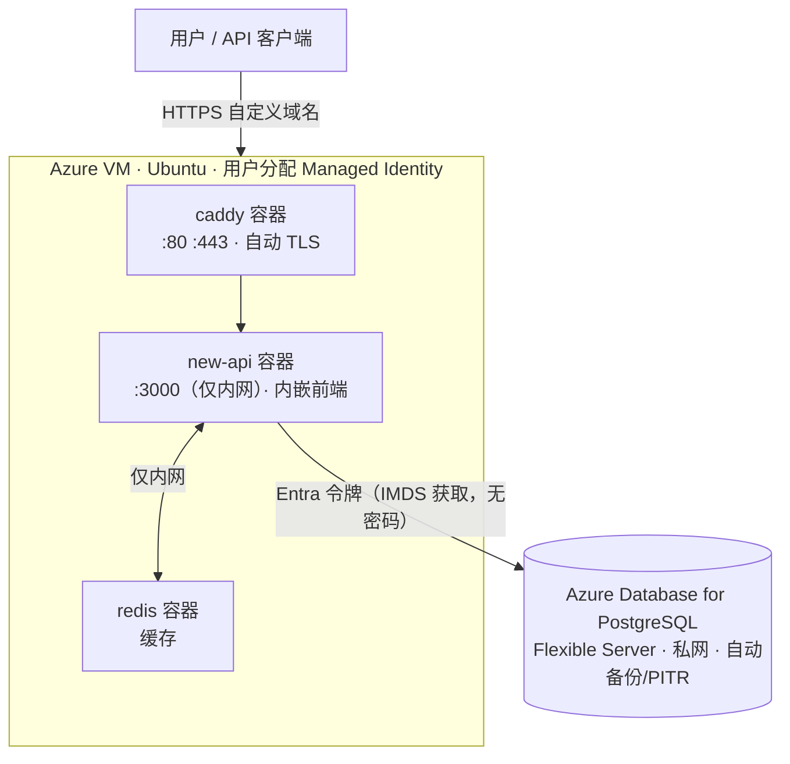

# 部署到 Azure：VM + 托管 PostgreSQL + Managed Identity

本文档介绍把 New API 部署到 Azure 的**推荐方案**：

- **应用（含内嵌前端）+ Redis + Caddy** 用 `docker compose` 跑在**一台 Azure VM** 上（前后端不拆分）。
- **只有 PostgreSQL 托管化**——使用 **Azure Database for PostgreSQL Flexible Server**，并通过**用户分配的托管标识（User-Assigned Managed Identity）+ Microsoft Entra 令牌**认证，**数据库密码不落盘**。
- Redis 仅作缓存，留在 VM 上的容器里，不对外暴露端口。

> 为什么这样分：业务的“真数据”只有 PostgreSQL（用户/令牌/渠道/账单/日志/设置）。把它托管化即可获得自动备份、时间点恢复（PITR）与可选高可用；Redis 与本地文件都是可重建的，无需外置。

***

## 架构概览



***

## 前置要求

| 项目 | 要求 |
| --- | --- |
| Azure 订阅 | 具备创建资源组、网络、VM、PostgreSQL 的权限 |
| 本地工具 | [Azure CLI](https://learn.microsoft.com/cli/azure/install-azure-cli)（`az`）、`psql` 客户端、SSH |
| 自定义域名 | 一个你能管理 DNS 解析的域名（如 `api.example.com`） |
| VM 规格 | 起步 `Standard_B2s`（2 vCPU / 4 GB），按负载上调 |
| 代码改动 | 本仓库已内置 PostgreSQL 托管标识支持（见 `model/postgres_azure_identity.go`），由环境变量 `PG_AZURE_MANAGED_IDENTITY=true` 开启 |

> 前后端说明：当前方案前端已随 Go 二进制一起内嵌进 `new-api` 镜像，与后端同进程部署，无需单独托管。若日后想拆分，可设置后端环境变量 `FRONTEND_BASE_URL` 把 Web 路由指向独立前端站点。

***

## 变量约定

下文命令统一使用以下变量，请按需修改后先在本地 shell 中 `export`：

```bash
export LOCATION="eastus"
export RG="rg-newapi-prod"
export VNET="vnet-newapi"
export SUBNET_VM="snet-vm"
export SUBNET_PG="snet-pg"
export IDENTITY="id-newapi"
export PG_SERVER="pg-newapi-$RANDOM"     # PostgreSQL 服务器名需全局唯一
export PG_DB="new-api"
export VM_NAME="vm-newapi"
export VM_SIZE="Standard_B2s"
export DOMAIN="api.example.com"          # 你的自定义域名
```

***

## 步骤一：创建资源组与用户分配的托管标识

```bash
az group create -n "$RG" -l "$LOCATION"

az identity create -g "$RG" -n "$IDENTITY"

# 记录托管标识的 clientId / principalId（后续要用）
export IDENTITY_CLIENT_ID=$(az identity show -g "$RG" -n "$IDENTITY" --query clientId -o tsv)
export IDENTITY_PRINCIPAL_ID=$(az identity show -g "$RG" -n "$IDENTITY" --query principalId -o tsv)
export IDENTITY_RES_ID=$(az identity show -g "$RG" -n "$IDENTITY" --query id -o tsv)
echo "clientId=$IDENTITY_CLIENT_ID  principalId=$IDENTITY_PRINCIPAL_ID"
```

> 用户分配的标识比系统分配更好：重建 VM 不丢失、可复用、有明确的 `clientId`。

***

## 步骤二：创建虚拟网络与托管 PostgreSQL（私网 + 仅 Entra 认证）

> **不想组建内网?** 可跳过本步骤的 VNet 部分,改用文末的 **「附录 · 可选:不使用 VNet（公网端点 + 防火墙白名单）」**——省去 VNet/委派子网/私有 DNS,配置更简单;Managed Identity 与认证方式完全不变。

```bash
# 1) 虚拟网络 + VM 子网
az network vnet create -g "$RG" -n "$VNET" -l "$LOCATION" \
  --address-prefixes 10.20.0.0/16 \
  --subnet-name "$SUBNET_VM" --subnet-prefixes 10.20.1.0/24

# 2) 给 PostgreSQL 专用的委派子网
az network vnet subnet create -g "$RG" --vnet-name "$VNET" -n "$SUBNET_PG" \
  --address-prefixes 10.20.2.0/24

# 3) 创建 Flexible Server：私网接入 + 仅 Entra 认证（禁用密码）
az postgres flexible-server create \
  -g "$RG" -n "$PG_SERVER" -l "$LOCATION" \
  --tier Burstable --sku-name Standard_B1ms --storage-size 32 --version 16 \
  --active-directory-auth Enabled --password-auth Disabled \
  --vnet "$VNET" --subnet "$SUBNET_PG" \
  --database-name "$PG_DB" --yes
```

要点：

- `--password-auth Disabled` → 服务器**只接受 Entra 令牌**，没有任何静态密码，安全性最高。
- `--vnet/--subnet` → 私网接入；CLI 会自动创建并链接私有 DNS 区域，使同 VNet 的 VM 用 `$PG_SERVER.postgres.database.azure.com` 解析到私网地址。
- 若你需要一个“应急”管理员密码，可改为 `--password-auth Enabled` 并妥善保管，但本方案不需要。

***

## 步骤三：把托管标识授权到 PostgreSQL

### 3.1 先把“你自己”设为 Entra 管理员

只有 Entra 管理员能在库内创建其它 Entra 角色。

```bash
export ME_OID=$(az ad signed-in-user show --query id -o tsv)
export ME_UPN=$(az ad signed-in-user show --query userPrincipalName -o tsv)

az postgres flexible-server ad-admin create \
  -g "$RG" -s "$PG_SERVER" \
  --display-name "$ME_UPN" --object-id "$ME_OID"
```

### 3.2 用你的 Entra 身份连进数据库，创建并授权“标识角色”

私网服务器需要从一台**能到达该 VNet 的机器**连接（最简单：先完成步骤四创建 VM，在 VM 上执行；或临时用云 Shell/跳板）。连接时令牌当密码：

```bash
# 获取 PostgreSQL 用的 Entra 令牌
export PGPASSWORD=$(az account get-access-token \
  --resource https://ossrdbms-aad.database.windows.net \
  --query accessToken -o tsv)

psql "host=$PG_SERVER.postgres.database.azure.com port=5432 dbname=$PG_DB user=$ME_UPN sslmode=require"
```

在 `psql` 中执行（把 `id-newapi` 换成你的标识名、`$IDENTITY_PRINCIPAL_ID` 换成实际值）：

```sql
-- 为“用户分配的托管标识”创建数据库角色（服务主体用 OID 形式）
SELECT * FROM pgaadauth_create_principal_with_oid('id-newapi', '<IDENTITY_PRINCIPAL_ID>', 'service', false, false);

-- 授权：允许连接、读写、并能执行 AutoMigrate 建表
GRANT ALL PRIVILEGES ON DATABASE "new-api" TO "id-newapi";
\c new-api
GRANT ALL ON SCHEMA public TO "id-newapi";
GRANT CREATE ON SCHEMA public TO "id-newapi";
\q
```

> 之后应用以 `user=id-newapi` + 令牌（无密码）连接；令牌由 VM 的托管标识在运行时自动获取与刷新。

***

## 步骤四：创建并配置 VM

```bash
# 创建 VM，挂载用户分配的托管标识，放进 VM 子网
az vm create \
  -g "$RG" -n "$VM_NAME" -l "$LOCATION" \
  --image Ubuntu2404 --size "$VM_SIZE" \
  --admin-username azureuser --generate-ssh-keys \
  --assign-identity "$IDENTITY_RES_ID" \
  --vnet-name "$VNET" --subnet "$SUBNET_VM" \
  --public-ip-sku Standard --nsg-rule SSH

# 开放 80/443
az vm open-port -g "$RG" -n "$VM_NAME" --port 80  --priority 1001
az vm open-port -g "$RG" -n "$VM_NAME" --port 443 --priority 1002

export VM_IP=$(az vm show -g "$RG" -n "$VM_NAME" -d --query publicIps -o tsv)
echo "VM public IP = $VM_IP"
```

**收紧 SSH**：把入站 SSH 规则的来源限制为你的办公/家庭出口 IP（在门户 NSG 或下面命令）：

```bash
MY_IP=$(curl -s ifconfig.me)
az network nsg rule update -g "$RG" \
  --nsg-name "${VM_NAME}NSG" -n default-allow-ssh \
  --source-address-prefixes "$MY_IP/32" 2>/dev/null || \
  echo "如规则名不同，请在门户中把 22 端口来源改为 $MY_IP/32"
```

验证 VM 能私网解析 PostgreSQL：

```bash
ssh azureuser@"$VM_IP"
# 在 VM 上：
nslookup $PG_SERVER.postgres.database.azure.com   # 期望返回 10.20.x.x 私网地址
```

***

## 步骤五：在 VM 上安装 Docker

```bash
# 在 VM 上执行
curl -fsSL https://get.docker.com | sudo sh
sudo usermod -aG docker "$USER"
exit   # 重新登录使 docker 组生效
ssh azureuser@"$VM_IP"
docker version && docker compose version
```

***

## 步骤六：获取源码并准备部署文件

在 VM 上克隆你的仓库（含你的“魔改”改动），随后新增三份部署文件。

```bash
git clone <你的仓库地址> newapi && cd newapi
```

### 6.1 `docker-compose.azure.yml`

```yaml
services:
  new-api:
    build: .                 # 用本仓库 Dockerfile 从源码构建（包含你的改动与前端）
    restart: always
    env_file: .env
    expose:
      - "3000"               # 仅暴露给 compose 内网，不对公网开放
    depends_on:
      - redis
    networks: [newapi]
    healthcheck:
      test: ["CMD-SHELL", "wget -q -O - http://localhost:3000/api/status | grep -o '\"success\":\\s*true' || exit 1"]
      interval: 30s
      timeout: 10s
      retries: 3

  redis:
    image: redis:7
    restart: always
    command: ["redis-server", "--requirepass", "${REDIS_PASSWORD}"]
    networks: [newapi]        # 无 ports 映射 → 仅内网可达

  caddy:
    image: caddy:2
    restart: always
    ports:
      - "80:80"
      - "443:443"
    volumes:
      - ./Caddyfile:/etc/caddy/Caddyfile:ro
      - caddy_data:/data
      - caddy_config:/config
    depends_on:
      - new-api
    networks: [newapi]

volumes:
  caddy_data:
  caddy_config:

networks:
  newapi:
    driver: bridge
```

### 6.2 `Caddyfile`（自动签发并续期 Let's Encrypt 证书）

```caddyfile
api.example.com {
    reverse_proxy new-api:3000
}
```

> 把 `api.example.com` 换成你的 `$DOMAIN`。

### 6.3 `.env`（仅存放本地必需的密钥；PostgreSQL 无密码）

```dotenv
# —— PostgreSQL：托管标识认证，DSN 不含密码 ——
PG_AZURE_MANAGED_IDENTITY=true
AZURE_CLIENT_ID=<IDENTITY_CLIENT_ID>
SQL_DSN=postgresql://id-newapi@pg-newapi-xxxx.postgres.database.azure.com:5432/new-api?sslmode=require

# —— Redis：仅内网容器，两处用同一个强随机密码 ——
REDIS_PASSWORD=<强随机串>
REDIS_CONN_STRING=redis://:<强随机串>@redis:6379

# —— 应用 ——
SESSION_SECRET=<强随机串>
TZ=Asia/Shanghai
```

生成强随机串：`openssl rand -base64 32`。填入要点：

- `AZURE_CLIENT_ID` = 步骤一的 `$IDENTITY_CLIENT_ID`。
- `SQL_DSN` 里的用户名 = 步骤三创建的角色名（`id-newapi`）；主机名换成你的 `$PG_SERVER...`；**务必带 `sslmode=require`、不带密码**。
- `REDIS_PASSWORD` 与 `REDIS_CONN_STRING` 中的密码必须一致。

保护文件权限：

```bash
chmod 600 .env
```

***

## 步骤七：构建并启动

```bash
docker compose -f docker-compose.azure.yml up -d --build
```

> 首次构建会编译前端（bun）与后端（Go），耗时较长属正常。

查看启动日志，确认托管标识与迁移成功：

```bash
docker compose -f docker-compose.azure.yml logs -f new-api
```

期望看到：

- `PostgreSQL using Azure Managed Identity authentication`
- `database migration started`
- 启动成功的监听日志

***

## 步骤八：DNS 与 TLS

1. 在你的 DNS 服务商，为 `api.example.com` 添加一条 **A 记录**指向 `$VM_IP`。
2. 解析生效后，Caddy 会自动为该域名签发并续期证书。
3. 访问 `https://api.example.com` 应能打开站点；首次进入按引导完成初始化。

***

## 步骤九：验证清单

```bash
# 1) 健康检查（公网）
curl -fsS https://$DOMAIN/api/status | head -c 200; echo

# 2) 容器内能否通过 IMDS 拿到 PostgreSQL 令牌（验证托管标识在容器内可用）
docker compose -f docker-compose.azure.yml exec new-api \
  wget -qO- --header="Metadata:true" \
  "http://169.254.169.254/metadata/identity/oauth2/token?api-version=2018-02-01&resource=https%3A%2F%2Fossrdbms-aad.database.windows.net&client_id=$IDENTITY_CLIENT_ID" \
  | head -c 120; echo

# 3) Redis 未对外暴露（应连接失败/超时）
nc -vz "$VM_IP" 6379 2>&1 | head -1 || echo "Redis 未对公网开放（符合预期）"
```

若第 2 步拿不到令牌（个别强化网络会拦截容器访问 IMDS），临时方案是让 `new-api` 服务使用宿主网络：在 compose 的 `new-api` 下加 `network_mode: host`（并相应调整 Caddy 反代目标为 `localhost:3000`），或在 VM 上添加到 `169.254.169.254` 的路由。

***

## 安全加固清单

- [x] PostgreSQL **禁用密码**、仅 Entra 令牌，数据库凭据零落盘。
- [x] PostgreSQL **私网接入**，不暴露公网。
- [x] `new-api` 只 `expose` 不 `ports`，Redis 无端口映射 → 均仅 compose 内网可达。
- [x] 仅 Caddy 对外开放 80/443，自动 HTTPS。
- [x] NSG 仅放行 80/443 与受限来源的 22。
- [x] `.env` 权限 `600`，仅含 Redis 密码与 `SESSION_SECRET`。
- [ ] 定期 `sudo apt update && sudo apt upgrade` 给 VM 打补丁。
- [ ] 如需更强隔离，可把 `.env` 中的 `REDIS_PASSWORD`/`SESSION_SECRET` 改为从 Azure Key Vault 启动时拉取（同样用本 VM 的托管标识，无需额外密钥）。

***

## 运维

### 发布更新（魔改后重建）

```bash
cd ~/newapi
git pull                       # 或推送你的改动后在此拉取
docker compose -f docker-compose.azure.yml up -d --build
docker image prune -f
```

### 数据库备份 / 恢复

PostgreSQL Flexible Server 自带**自动备份**与**时间点恢复（PITR）**：

```bash
# 按时间点恢复成一台新服务器
az postgres flexible-server restore \
  -g "$RG" -n "${PG_SERVER}-restored" \
  --source-server "$PG_SERVER" \
  --restore-time "2026-01-01T00:00:00Z"
```

可在门户调整备份保留天数、是否异地冗余、是否启用高可用（HA）。

### 日志

```bash
docker compose -f docker-compose.azure.yml logs -f --tail=200 new-api
docker compose -f docker-compose.azure.yml logs -f --tail=200 caddy
```

### 常见问题

| 现象 | 排查方向 |
| --- | --- |
| 启动报 token / 认证失败 | `AZURE_CLIENT_ID` 与 `SQL_DSN` 用户名是否对应同一标识；步骤三角色与授权是否完成 |
| 连不上数据库 | VM 上 `nslookup $PG_SERVER...` 是否解析到私网；子网/私有 DNS 区域链接是否正常 |
| 容器内拿不到令牌 | 见步骤九的 IMDS 回退方案 |
| 证书签发失败 | DNS A 记录是否指向 `$VM_IP`；80/443 是否放行；域名是否正确 |
| 迁移未执行 | 单 VM 单实例默认即 master 节点；查看 `new-api` 日志是否有 `database migration started` |

### 后续若要横向扩展

当前单 VM、本地 Redis 完全够用。若以后扩成多台应用 VM，把 Redis 换成 **Azure Cache for Redis** 以共享缓存/限流状态（仅需改 `REDIS_CONN_STRING`），并确保只有一台实例承担定时任务（master 节点）。

***

## 附录 · 可选:不使用 VNet（公网端点 + 防火墙白名单）

如果你不想组建内网,可以让 PostgreSQL 使用**公网端点 + 防火墙 IP 白名单**,替代步骤二的私网 VNet。适合单 VM + 单库的小规模部署:省去 VNet、委派子网、私有 DNS。

> **Managed Identity 不受影响**:公网模式同样支持 `--password-auth Disabled --active-directory-auth Enabled`。本方案下代码、`SQL_DSN`、`.env`、`AZURE_CLIENT_ID` **全部不变**,只是 PG 多了一个受防火墙保护的公网端点(同区域时流量仍走 Azure 内部骨干网,不出 Azure)。

### 与私网方案的差异

| | 私网 VNet(步骤二~四) | 公网 + 防火墙(本附录) |
| --- | --- | --- |
| VNet / 委派子网 / 私有 DNS | 需要 | **不需要** |
| 步骤三授权 | 须在 VM 上跑 `psql` | 可**直接从本地**跑 |
| 访问控制 | 网络隔离 | 防火墙白名单 + TLS + Entra 三重 |
| `SQL_DSN` / 代码 / `.env` | — | **完全不变** |

### 替换步骤二:创建公网 PostgreSQL

```bash
# 直接创建 Flexible Server（公网端点,先不放行任何 IP）
az postgres flexible-server create \
  -g "$RG" -n "$PG_SERVER" -l "$LOCATION" \
  --tier Burstable --sku-name Standard_B1ms --storage-size 32 --version 16 \
  --active-directory-auth Enabled --password-auth Disabled \
  --public-access None \
  --database-name "$PG_DB" --yes
```

- `--public-access None` → 启用公网端点但**不放行任何 IP**,随后用防火墙规则精确放行。
- 不再需要 `--vnet/--subnet`,也无需 `$VNET/$SUBNET_VM/$SUBNET_PG` 这几个变量。

### 替换步骤三:从本地直接授权

公网模式下,先放行你本地 IP,即可在**本机**完成步骤三的角色创建与授权(无需等 VM):

```bash
MY_IP=$(curl -s ifconfig.me)
az postgres flexible-server firewall-rule create -g "$RG" -n "$PG_SERVER" \
  --rule-name allow-admin --start-ip-address "$MY_IP" --end-ip-address "$MY_IP"
```

随后照常执行步骤三的 3.1 / 3.2(设 Entra 管理员、用令牌当密码连 `psql`、`pgaadauth_create_principal_with_oid` + GRANT)。授权完成后,这条管理员规则可保留(便于日后维护)或删除。

### 替换步骤四的网络部分:创建 VM 并放行其公网 IP

创建 VM 时**去掉** `--vnet-name/--subnet`(az 会自动建默认网络,你无需关心);`--public-ip-sku Standard` 即静态 IP,不会变:

```bash
az vm create \
  -g "$RG" -n "$VM_NAME" -l "$LOCATION" \
  --image Ubuntu2404 --size "$VM_SIZE" \
  --admin-username azureuser --generate-ssh-keys \
  --assign-identity "$IDENTITY_RES_ID" \
  --public-ip-sku Standard --nsg-rule SSH

export VM_IP=$(az vm show -g "$RG" -n "$VM_NAME" -d --query publicIps -o tsv)

# 放行 VM 的公网出口 IP（Standard SKU 入站=出站同一 IP）
az postgres flexible-server firewall-rule create -g "$RG" -n "$PG_SERVER" \
  --rule-name allow-vm --start-ip-address "$VM_IP" --end-ip-address "$VM_IP"
```

其余(开放 80/443、收紧 SSH)与步骤四相同。验证连通改为:

```bash
# 在 VM 上:解析应得到公网地址,而非私网 10.20.x.x
nslookup $PG_SERVER.postgres.database.azure.com
```

### 安全注意

- **不要**添加 `0.0.0.0` 规则(Allow public access from any Azure service)——那等于放行全 Azure,只加 VM 与管理员的**具体 IP**。
- `SQL_DSN` 继续带 `sslmode=require`(公网更要,可进一步用 `verify-full` 校验服务器证书)。
- VM 用 `--public-ip-sku Standard`(静态 IP),IP 不变,防火墙规则无需频繁更新;若改用 NAT 网关/负载均衡出站,需放行其出站 IP。
- 其余安全加固(仅 Caddy 对外、Redis 不暴露、`.env` 权限 `600` 等)与正文一致。

***

## 附录 · 可选:暂不外置 PostgreSQL 时的数据导出与迁入

如果你想先用**本地数据库**(容器内 PostgreSQL 或 SQLite)跑起来,之后再迁到外置 Azure PostgreSQL,本节说明如何导出数据并迁入。

> New API **没有内置的「导出数据」功能**;所谓导出就是在**数据库层面做 dump**。业务数据(用户/令牌/渠道/账单/日志/设置)**全部**在主库里,Redis 与本地文件都是可重建的,无需导出。

### 情况 A:容器内 PostgreSQL(推荐)

`pg_dump` 走 MVCC 一致性快照,**在线导出即可、无需停服**(服务名按你 compose 里的 `postgres` 调整,密码用你设置的值):

```bash
# custom 格式（体积小、可选择性恢复，推荐）
docker compose exec -T -e PGPASSWORD=<你的PG密码> postgres \
  pg_dump -U root -d new-api -Fc > newapi-$(date +%F).dump
```

将来迁入外置 Azure PostgreSQL 时**同构、无缝**(目标库用临时管理员或托管标识令牌当密码连):

```bash
pg_restore --no-owner --no-privileges --no-acl \
  -d "host=$PG_SERVER.postgres.database.azure.com user=id-newapi dbname=new-api sslmode=require" \
  newapi-xxxx.dump
```

> `--no-owner --no-privileges`:源库 owner 是 `root`,目标库角色不同(托管标识角色 `id-newapi`),必须忽略 owner/权限,否则报错。导入前确保已完成步骤三的角色与授权;若用托管标识连接,先取令牌当密码:`export PGPASSWORD=$(az account get-access-token --resource https://ossrdbms-aad.database.windows.net --query accessToken -o tsv)`。

### 情况 B:SQLite

不配 `SQL_DSN` 时用 SQLite,数据库就是一个文件:容器内 `WORKDIR /data` + 挂载 `./data:/data`,所以它在宿主机 `./data/one-api.db`。最稳妥是**停写后直接复制**:

```bash
docker compose stop new-api
cp ./data/one-api.db ./one-api-$(date +%F).db
docker compose start new-api
```

> **SQLite 的 dump 不能直接导入 PostgreSQL**(SQL 方言、数据类型、布尔/自增表示都不同)。从 SQLite 迁 PG 需用 `pgloader` 之类工具转换,或先让 new-api 在空 PG 库上跑一次 `AutoMigrate` 建好表结构、再单独迁数据,较繁琐。

### 建议:打算外置就从一开始用 PostgreSQL

既然终点是外置 Azure PostgreSQL,**建议本地阶段就用 PostgreSQL 容器**(官方 `docker-compose.yml` 默认即是),保持同构 —— 将来 `pg_dump → pg_restore` 一步到位、零转换,避免 SQLite→PG 的迁移成本。

### 注意

- 若单独配了 `LOG_SQL_DSN`(日志独立库),需对该库**另外 dump 一次**;默认未配时日志与主库同库,一次导出即可。
- 导出文件含全部业务数据,请妥善保管;生产环境务必先把 compose 里的默认密码 `123456` 改掉。
